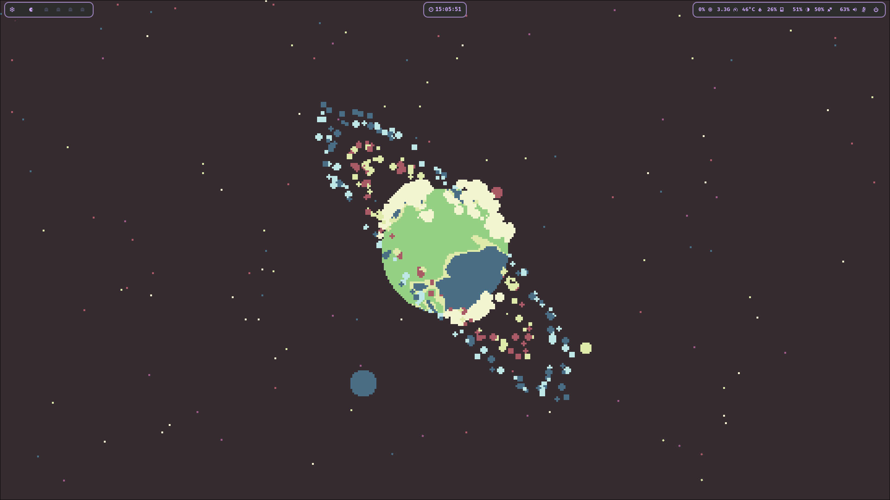
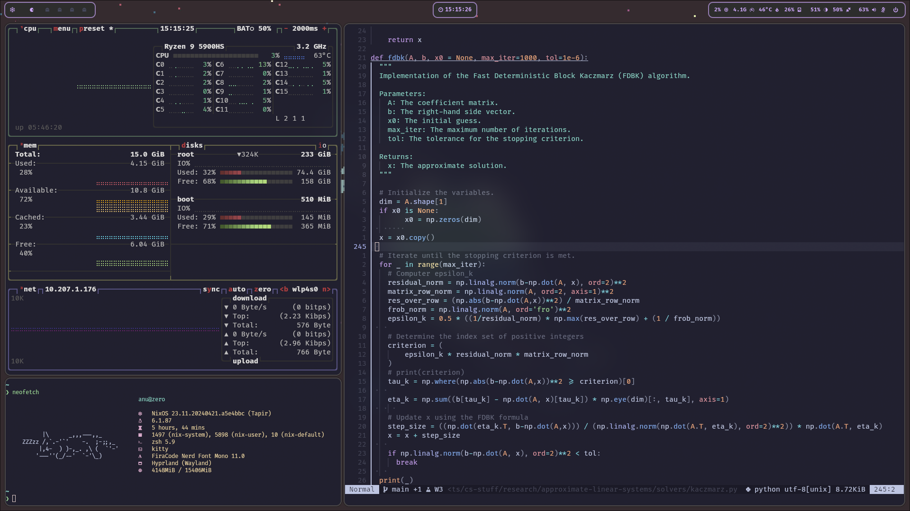

<h3 align="center">
 <br/>
 
  <a href="https://github.com/ae-bii">anu's</a> NixOS config 
 
</h3>

<p align="center">
 <a href="https://github.com/ae-bii/nix-config/stargazers"></a>
 <a href="https://github.com/ae-bii/nix-config/commits"></a>
</p>

hello! in this repo, you'll find all of the files for my NixOS config.

## table of contents

1. [pruned file tree](#pruned-file-tree)
2. [getting started](#getting-started)
3. [screenshots](#screenshots)
4. [todo](#todo)

## pruned file tree
```
.
├── home-manager
├── misc
├── modules
│   ├── home-manager
│   │   ├── hyprland
│   │   ├── neovim
│   │   │   └── nvim
│   └── nixos
├── nixos
├── overlays
├── pkgs
└── waybar
```

## getting started

### install
```bash
cd ~
git clone https://github.com/ae-bii/nix-config.git
cd ~/nix-config
sudo nixos-rebuild switch --flake .#zero
```

## screenshots



## todo
- [x] move hyprland conf to home.nix
- [ ] move fuzzel conf to home.nix
- [x] move mako conf to home.nix
- [x] add clipboard
- [ ] add screenlock
- [ ] sync colors across entire config
- [ ] add hosts
